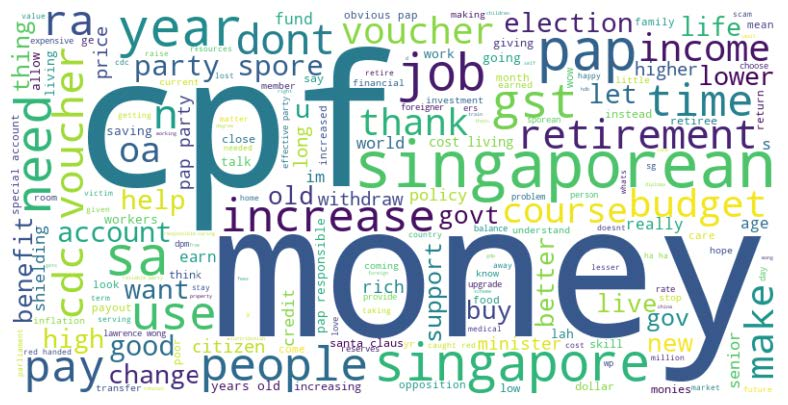

# Social-Media-LDA-Analysis

A comprehensive analysis of social media data using LDA topic modeling to uncover key themes and insights.

## Overview

This project involves collecting and analyzing social media data from platforms such as YouTube, Facebook, and Reddit. The primary goal is to identify and understand the underlying topics discussed in the collected data using Latent Dirichlet Allocation (LDA) topic modeling. The analysis provides insights into key themes such as financial concerns, political sentiment, social and economic issues, public services, and quality of life.

## Key Features

- **Data Collection**: Collects data from YouTube, Facebook, and Reddit.
- **Data Preprocessing**: Includes comprehensive stop word removal and text cleaning.
- **LDA Topic Modeling**: Uses coherence scores to determine the optimal number of topics.
- **Insights and Analysis**: Provides detailed insights and themes from the data.

## Results

The analysis identified 10 key topics in the combined social media dataset, focusing on themes such as CPF and retirement planning, political sentiment towards the PAP party, cost of living, job market conditions, and public services.

## Usage

To launch the project, open the Jupyter notebook located at `/Social Media Analysis and LDA Topic Modeling.ipynb`.

## Sample Topics

